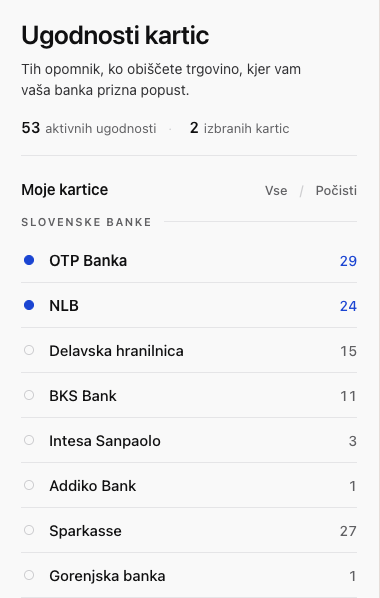
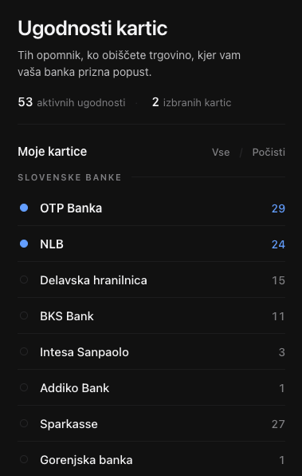
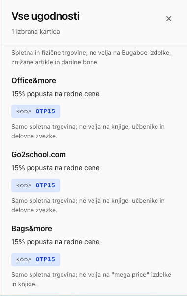

# Card & Bank benefits / discounts

> A browser extension that quietly tells you when the store you're on offers a discount for the bank cards you actually have.

Built for Slovenian cardholders — covers **8 Slovenian banks** plus universal **Visa and Mastercard tier benefits**, **288 active discounts** in total. UI is in Slovenian. Open source.

[](LICENSE)


---

## Screenshots

<p align="center">
  
  
</p>

<p align="center">
  <br>
  <em>Notification appears top-right when you land on a merchant with a matching benefit.</em>
</p>

<p align="center">
  <br>
  <em>"Preglej vse izbrane ugodnosti" — full list grouped by bank.</em>
</p>

---

## What it does

Slovenian bank benefits are scattered across PDFs, microsites, and partner pages. Most cardholders forget which discounts they're entitled to. This extension closes that gap:

- You pick which banks/cards you hold once
- It quietly watches the URL bar
- When you land on a merchant that offers you a discount, a small notification appears in the corner with the code (if any), the conditions, and a one-click copy button

That's it. No accounts, no telemetry, no remote calls — the entire benefits database ships with the extension.

## Supported banks & card tiers

| Source                       | Active benefits |
| ---------------------------- | --------------: |
| OTP Banka                    | 29              |
| NLB                          | 24              |
| Delavska hranilnica          | 15              |
| BKS Bank *(tier-aware)*      | 11              |
| Intesa Sanpaolo              | 3               |
| Addiko Bank                  | 1               |
| Sparkasse / Diners D-TOREK   | 27              |
| Gorenjska banka              | 1               |
| Visa Classic                 | 9               |
| Visa Gold                    | 22              |
| Visa Platinum                | 24              |
| Visa Signature               | 25              |
| Visa Infinite                | 25              |
| Visa Business                | 11              |
| Mastercard World             | 30              |
| Mastercard World Elite       | 31              |
| **Total**                    | **288**         |

Most data is scraped directly from the issuing banks' public benefit pages. The scraping config lives in `scripts/` so anyone can re-run or extend it.

## Install

You need Python 3 once to run the build script.

```bash
python3 scripts/build_extension.py
```

This produces `dist/chrome/` and `dist/firefox/` — drop-in unpacked builds.

### Chrome / Edge / Brave / Opera

1. Open `chrome://extensions/`
2. Enable **Developer mode** (top right)
3. **Load unpacked** → pick `dist/chrome`
4. Pin the extension icon to your toolbar

### Firefox

1. Open `about:debugging#/runtime/this-firefox`
2. **Load Temporary Add-on…** → pick `dist/firefox/manifest.json`

For a persistent Firefox install you'd need to sign the package via [AMO](https://addons.mozilla.org).

### Safari (macOS)

```bash
xcrun safari-web-extension-converter dist/chrome
```

Builds an Xcode project — open it, build, and enable the extension in Safari's preferences.

## Usage

1. Click the toolbar icon → tick the banks/cards you hold
2. Browse normally. If you land on a merchant with a matching deal, a notification appears top-right with the discount, code, and conditions
3. Click **"Preglej vse izbrane ugodnosti"** in the popup to see the full list of deals available to you

## How it works

```
┌─────────────────────────┐         ┌─────────────────────────┐
│ benefits.js             │         │ popup.html / popup.css  │
│ ──────────              │         │ ────────────────        │
│ const BENEFITS_DATABASE │         │ Bank picker UI          │
│ = {                     │         │ Modal with full list    │
│   'OTP Banka': [ … ],   │         └──────────┬──────────────┘
│   'NLB': [ … ],         │                    │
│   …                     │                    ▼
│ }                       │         ┌─────────────────────────┐
└──────────┬──────────────┘         │ chrome.storage.sync     │
           │                        │ selectedBanks: [ … ]    │
           ▼                        └──────────┬──────────────┘
┌─────────────────────────┐                    │
│ background.js           │◀───── getBenefits ─┤
│ (SW on Chrome,          │                    │
│  bg page on Firefox)    │                    ▼
└──────────┬──────────────┘         ┌─────────────────────────┐
           │                        │ content.js              │
           └──── BENEFITS ─────────▶│ ────────────            │
                                    │ matches URL → injects   │
                                    │ notification top-right  │
                                    └─────────────────────────┘
```

Matching is purely client-side — domain string comparison against the `domains: []` array on each benefit, with subdomain support (`*.afrodita.eu`). Expired benefits are filtered out at runtime by ISO date comparison.

## Project structure

```
├── manifest.base.json        Shared MV3 fields
├── manifests/
│   ├── chrome.json           Chrome MV3 overrides (service_worker)
│   └── firefox.json          Firefox MV3 overrides (background.scripts)
├── background.js             Message bridge between popup and content script
├── benefits.js               The benefits database (single source of truth)
├── content.js                Runs on every page; matches URL → shows notification
├── notification.css          In-page notification styles
├── popup.{html,css,js}       Extension popup UI
├── scripts/
│   ├── build_extension.py    Merges base + per-browser manifest, copies files into dist/
│   ├── scrape_benefits.py    Scraper for new bank benefit pages
│   ├── merge_scraped_benefits.py  Merge scraper JSON output into benefits.js
│   ├── apply_to_benefits.py  Splice generated sections into benefits.js
│   └── test_matching.js      Node script — domain matcher regression check
├── icons/                    Extension icons (16, 48, 128 px)
└── dist/                     Generated browser bundles (gitignored)
```

The reason we split the manifest per browser: Chrome MV3 wants `background.service_worker`, Firefox MV3 wants `background.scripts`. The build script merges `manifest.base.json` with the per-browser override file.

## Adding a new benefit

Edit `benefits.js` and add an entry to the appropriate bank/tier array:

```js
{
  merchant: 'store name',
  domains: ['example.com', 'www.example.com'],
  discount: 'Discount description (Slovenian)',
  code: 'DISCOUNTCODE',   // or null
  conditions: 'Terms (Slovenian)',  // or null
  expires: '2026-12-31',   // ISO date, or null for no expiry
  link: 'https://issuing-bank.example/benefits-page'  // or null
}
```

For Visa tier benefits that apply across multiple tiers (e.g. Booking.com appears in Classic/Gold/Platinum/…), define a shared object at the top of `benefits.js` (e.g. `_booking`) and reference it from each tier array. Same for Mastercard tiers.

Then:

```bash
python3 scripts/build_extension.py
node scripts/test_matching.js     # regression check
```

Reload the unpacked extension in your browser to test.

## Scraping new banks

The repo includes a Python scraper for extracting benefits from bank websites:

```bash
python3 -m venv .venv && source .venv/bin/activate
pip install -r scripts/requirements.txt
python scripts/scrape_benefits.py --config scripts/sources.json --output scripts/benefits.json
```

See `scripts/sources.example.json` for the config format.

For SPA / JS-rendered pages (most modern bank sites), use Playwright. The agents that scraped the existing data used `mcp__plugin_playwright_playwright__browser_navigate` — any Playwright-equivalent will work.

## Privacy

- **No data is sent anywhere.** The matching happens entirely in your browser
- **No accounts, no telemetry, no analytics.** The extension has no remote dependencies
- **`storage.sync`** is the only thing the extension writes to — and it only stores which banks you ticked. Sync only happens to your own browser-account storage (Chrome/Firefox/Edge accounts) if you have it enabled
- **`<all_urls>`** is requested because the extension needs to read the current tab's URL to check for matches. The URL is never transmitted

## Contributing

PRs welcome — see [CONTRIBUTING.md](CONTRIBUTING.md). The easiest contribution: notice an out-of-date benefit (expired, code changed, new merchant), open a PR with the fix.

## License

[MIT](LICENSE)
